#AGV 發展現況

這邊整理的是近幾年來 ( 2016前 )  AGV ( Automated Guided Vehicle ) 在大型工廠、物流中心、倉儲管理等應用案例與技術探討，這裡不會提到早期傳統軌道式、導引線式、磁條式，特定路線設計的AGV。

主要針對正在發展中的移動式機器人 ( Mobile Robot ) 使用Laser、3D Sensor、Lidar、RFID等技術達到自主定位導航，以SLAM ( Simultaneous Localization and Mapping ) 為基礎的AGV發展現況。 

- - -
## 基於Tag(RFID or 2D Bar codes)+Lidar(IR)AGV
在2013年時 Amazon 展示了 Kiva robots once the marvel of warehouses everywhere，倉儲機器人，採用於地面貼上Tag作為AGV的定位與路徑規劃，透過AGV前方的IR Sensor偵測障礙物，由中央監控平台管理所有的AGV，規劃移動路徑與工作排程，每個Tag所貼的位置距離依據AGV的大小為單位佈建，採取如棋盤格座標方式定位 

每次所移動的距離與轉彎的角度都是固定的(如等距等速與自轉180度或90度)。
Tag的建置僅要求工廠或倉儲的地面需平整，避免移動過程起伏導致定定位錯誤或移動過程偏離。 
在佈建Tag的過程必不是整個場域都建置，會依據移動位置的複雜度與同一時間AGV移動的數量來做調配規劃。

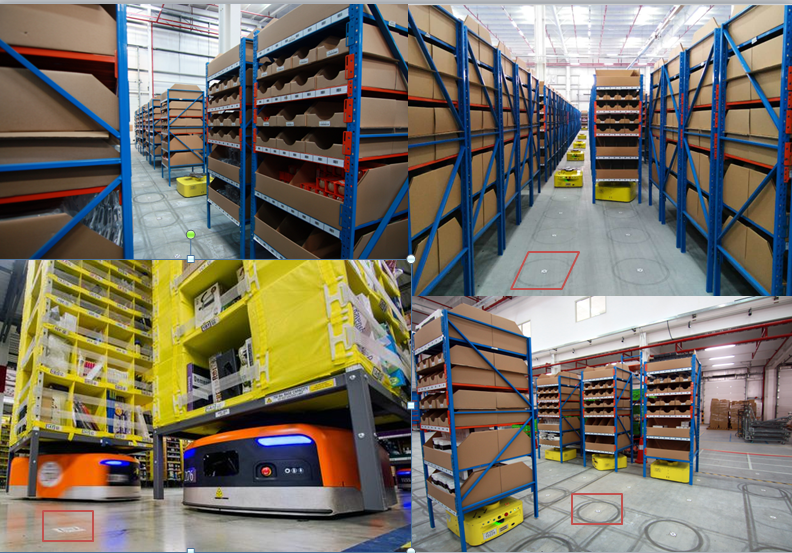
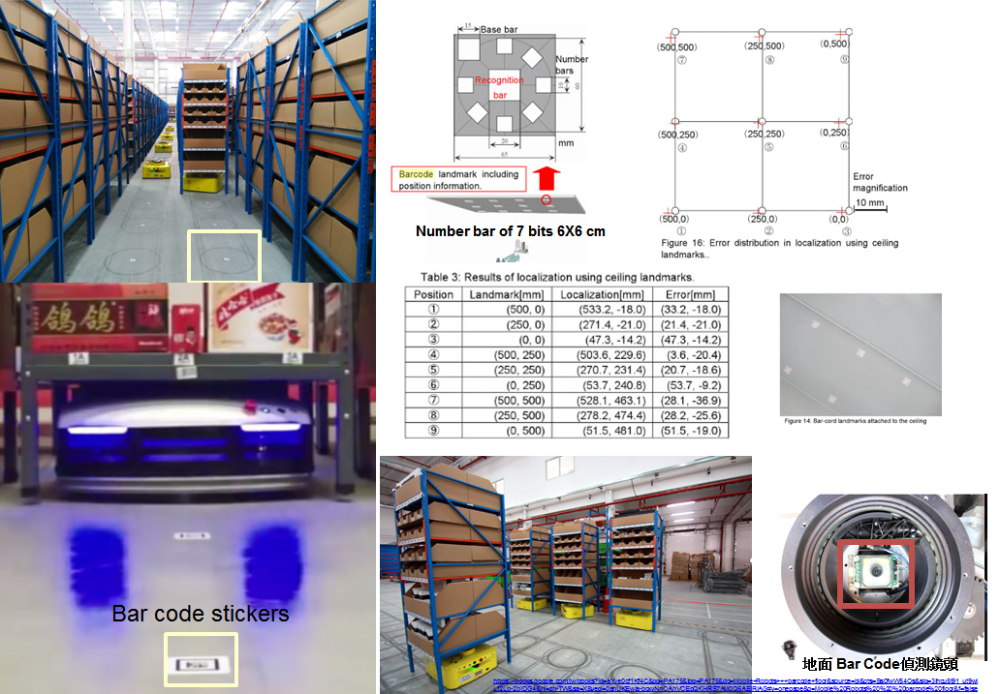

針對上述的介紹，接著說明目前這類技術的AGV公司與相關硬體規格

##[Amazon Kiva](https://www.amazonrobotics.com/ )
**關於 Kiva 5大重點**

• 客製化Kiva可移動的貨架高度 ( shelves )

• 使用2D QR codes佈建於地面定位基準點 ( known as "fiducials" )

• 內建重量偵測、雷射掃描與其他sensor

• 能移動到貨架下方直接抬起行動

• 多台Kiva移動時之路線規劃 ( Complex and robust software system ) 

YouTube 影片 : [Kiva AGV](https://www.youtube.com/embed/z_R8feyCu-M)

在Kiva的前方有10組的單點紅外線陣列模組以及最下方有條壓力感知器，負責做前方障礙物偵測避障，但在線上資料中沒有提到當出現障礙物時，或是有人員移動經過等，Kiva會如何排除這類問題。 
在Kiva的核心有兩組鏡頭，一組是看地面的Bar code 偵測掃描做路徑規劃與定位、而另一組是裝置上方掃描貨架底部bar code的資訊，如下圖所示。 

在針對Bar code的條碼辨識採用了ADI ADSP-BF548處理器，在晶片中做影像處理，提高在移動過程中辨識的速度 

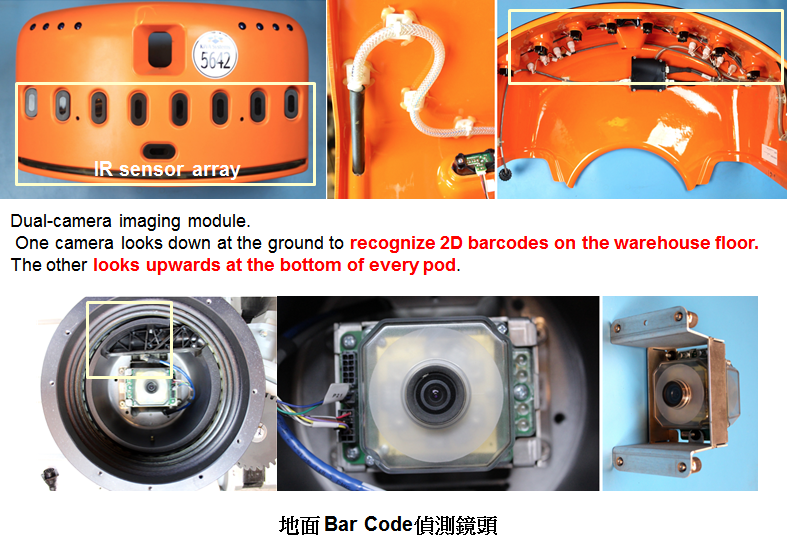

Kiva目前有提供兩種載貨規格(1)貨架長框在60~100cm的可負重約1000 pounds(430KG)，(2)較大的貨架可自訂，可負重約3000 pounds(1200KG)。在移動速度上約在1.3m/second 
建構場域約：600~6000坪 
建構AGV成本每台約在100~150萬台幣 
- - -
##[上海快仓智能](http://www.flashhold.com/)
採用跟Kiva類似的技術 

• 每台AGV 約50萬台幣，包含軟體系統價格。 

• 特別提到快速充電與換電池 

• 移動速度一樣在1.5m/s 

• 支援的貨架規格 90×90cm 和 120x120cm， 

• 負重約在300到900kg 

• 整合了中央控制與通訊，負責AGV調度、控制，AGV間的通訊， 

• 官方提到智能倉儲系統，基於據分析的隨機存儲，基於搜索引擎的命中算法，基於資源與任務的智能調度。
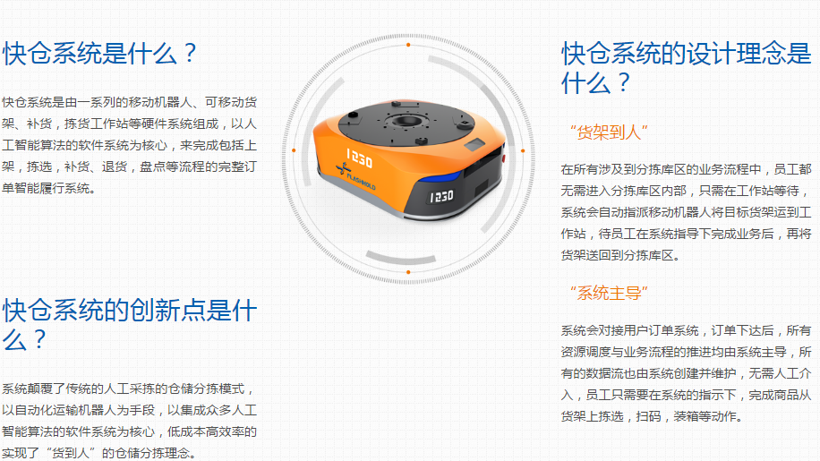
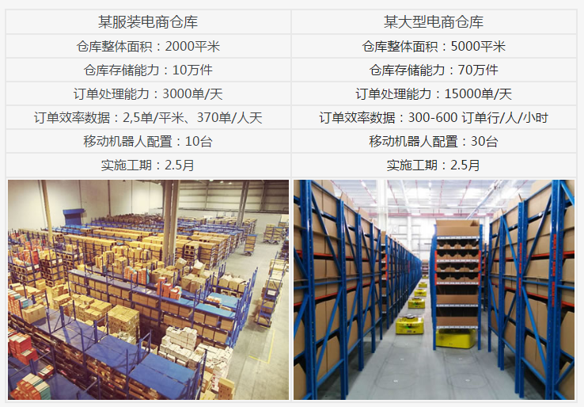

- - -
##[Cainiao菜鳥網絡](https://www.cainiao.com/)
這是在今年中國智能倉儲管理會議中Cainiao所展示的完整物流管理平台，在1分11秒鐘展示他們強大火力再AGV導入應用上成果，多台協同搬運、避障、排隊的展現。

詳細技術細節與規格無提供，這是由阿里巴巴所投資成立的智能物流管理研發從物到人的Total Solution。
YouTube 影片 : [智能物流倉儲](https://www.youtube.com/embed/Wu1RrVdrGFk)

- - -
##[Areyorange](http://www.greyorange.com/ )
是一間專注做倉儲AGV管理公司，機構設計技術來看大家都大同小異，在定位上也是採用Bar code方式，軟體銀行同時也有投資這間公司，實際上發展狀態未知。 

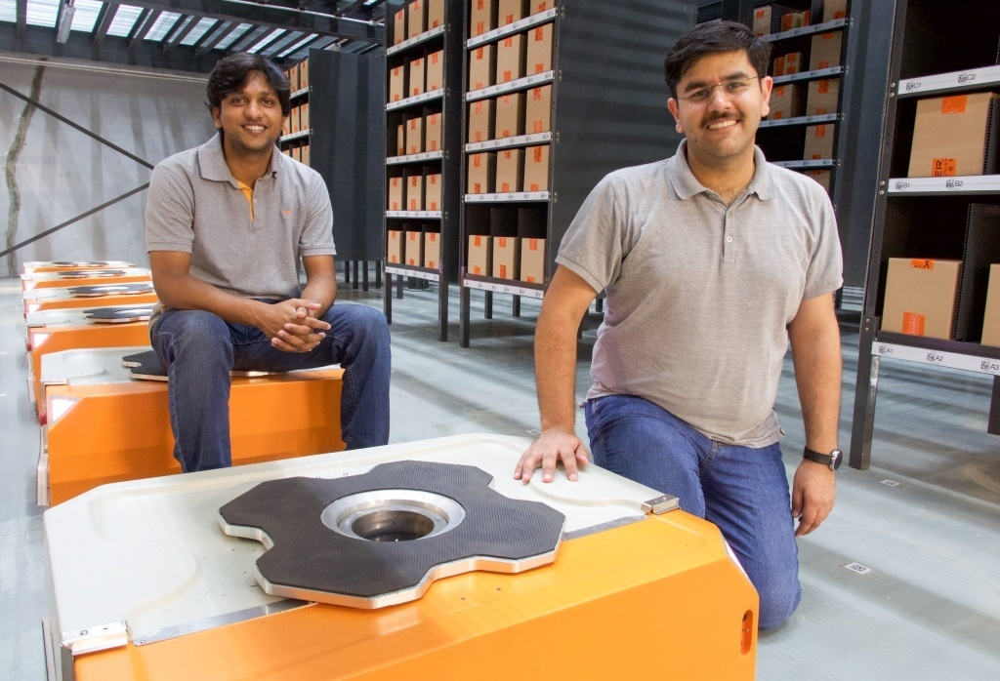

- - -
## 基於Vison+Lidar AGV 
接下來是幾間朝著全自主AGV發展狀況，基於影像與雷達方法識別環境與定位，以SLAM與VSLAM的方式來達到路徑規劃與導航避障，但這邊應用的做法就不是採取搬動貨架的形式，而已在固定式貨架或倉儲中移動到指定位置取箱(揀貨)在移動到特定地點，再藉由人力來處理貨物或零組件，在Survey到的幾間公司中大部份還是採用2D SLAM的技術在實際應用上，以下是相關技術發展的AGV公司與實際展示。

- - -
##[LOCUS Robotics](http://www.locusrobotics.com/solution.php)

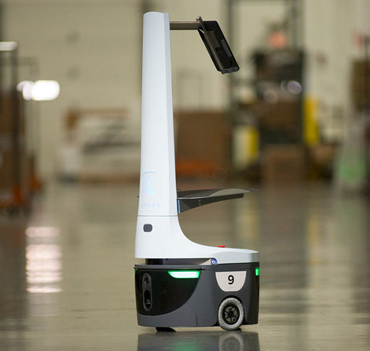

YouTube 影片 : [LOCUS](https://youtu.be/MMm3EgwbvMY)

- - -

##[Adept Autonomous Mobile Platform](http://www.adept.com/)
採用前方Lidar 180 度進行SLAM定位&導航 

Tere's some specs: 
• Weighs 60 kg, can haul 60 kg 
• 13 hour run time, 3.5 hour recharge time, autonomous rechargingon dock 
• Turning radius of zero degrees thanks to differential steering 
• Maximum speed of about 4 mph, or 0.0000000056 light speed 
• Programmable voice and audio prompts 
• Optional joystick for shenanigans 

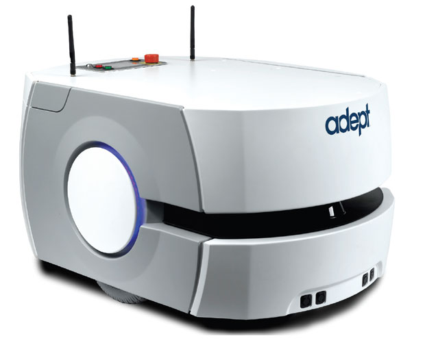

- - -

##[OTTO, self-driving vehicle designed](https://www.ottomotors.com/)
前後雙 Lasers 掃描定位 

It's got 20-meter lasers front and back (with an option for 50-meter range), and canlocalize against an existing basemap with an accuracy of about an inch 

For a robot of this size (unloaded, it's 500 kg), and with a brisk top speed of 2m/s (4.5 mph), safety is a critical aspect of autonomy. Fully loaded, OTTO's atotal mass of 2,000 kilograms 

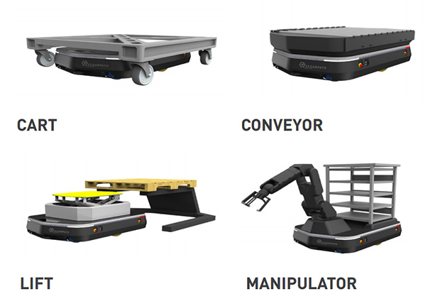

YouTube 影片 : [OTTO](https://youtu.be/KIzMr0oOank)

- - -

##[IAM Robotics](https://www.iamrobotics.com/) 

Robot Speed

Travels 3f/s 200 picks per hour

Robot Size Weight: 400 lbs Height: 78" Width: 27.7" Length: 43.6" 

Top Working Shelf: 85"

Bottom Working Shelf: 3"

Arm: Fanuc 200iD 7L Lift

Capability: 15lbs

Safety

Multi-Directional Sensors: 9ft range Emergency Stop Button Safety Lights Audible Indicators 

Battery

Technology: Lithium Ion Swappable & Rechargable Batteries: 2batteries good for 3 shifts 

YouTube 影片 : [IAM Robotics](https://youtu.be/ye0a-yduMN4)

- - -

##[Magazino Robots(德國)](http://www.magazino.eu/) 

YouTube 影片 : [Magazino Robots](https://youtu.be/XrtI9wNPdr0)

- - -

##[Fetch Robotic](http://fetchrobotics.com/freight/) 

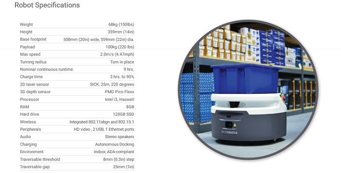

YouTube 影片 : [Fetch Robotic](https://youtu.be/CEIUrF7iOXk)

- - -

##[速感科技(北京)](http://www.qfeeltech.com/ulbrain/ ) 
號稱結合 Lidar+Vison+IMU 的AGV，但目前尚未有產品，看到他們在實驗的機器跟我們一樣用Turtlebot在驗證3D SLAM

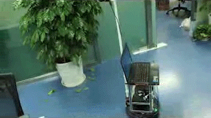 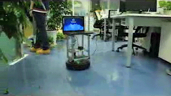

影片 : [2D SLAM NAV ](http://www.qfeeltech.com/ulbrain/imgs/zizhudaohang.mp4 )

- - -

##[未來機器人有限公司(香港)](http://weshare.hk/mickey/articles/4574455 )
只要輸入有關工廠或倉庫的平面圖，再讓叉車自行在工廠或倉庫巡視，了解起貨落貨等指定地點，即可自己計算出行走路線。叉車可以負荷2噸重物，速度則依據安全規定，最高速每秒1.5米。用戶可視乎個別情況，利用手機應用程式控制叉車前往指定運貨地點，非常方便。 他表示「智能叉車」的一大優點，是可以在現有環境中自主運行，「工廠或倉庫毋須作出任何環境改動，能大大提升行業的自動化水平及降低人力成本。」獲注資1500萬 擬進軍內地 藉有關發明，劉雲輝獲「大學科技初創企業資助計劃」提供40萬元創業資金，2015年聯同團隊中的博士畢業生創立「未來機器人有限公司」，將科研成果產業化，一年間該公司已獲創投基金注資逾1,500萬港元。劉雲輝指會利用資金進一步優化及鑽研技術，並將積極進軍內地市場。 未來機器人公司技術總監李陸洋補充指，由於叉車需要靈活到倉庫各個地點，故在倉庫內設軌道是不可行，相反「智能叉車」能自行生成路徑，大大提高其靈活性。售價僅外國同級產品三分一 該「智能叉車」售價約每部50萬港元，等同外國同級數產品的三分一價錢，而一部「智能叉車」約可抵上三名叉車工人，壽命大約5年，目前已有港資及美資企業購買，至今共賣出10部。 劉雲輝解釋，內地一名叉車工人的一年工資，以港幣計算約為10萬元，換言之使用「智能叉車」平均兩年至3年就足以回本。 李陸洋續指，香港叉車工人的工資更高，一年工資連福利約為25萬港元，回本時間將會更短。劉雲輝又透露，目前正在與製藥、航空及衛生等多家世界五百強企業洽談銷售及使用事宜，並早在數月前已開始跟香港國際機場接洽，有望在本年內投入服務。

 

- - -
##[GrabIt協同機器人](http://www.inviarobotics.com/)
GrabIt協同機器人能舉起30磅(約14公斤)的重量，能抓取的物品最小如一副撲克牌，最大寬度則可達24吋(約61公分)；它能接觸到的貨架高度可達8英呎(約2.4公尺)，可連續工作10小時不必充電。而Transit協同機器人則是會收集單一客戶訂單上的所有物品，然後將之送到郵務室打包裝箱，準備送貨。

影片 : [GrabIt](https://vimeo.com/138660808 )

- - -

#總結 

在全球各地都很積極地在發展AGV應用市場，針對不同需求打造出適合的服務，目前看見倉儲物流上的應用是大家一致的方向，人機協同輔助與全自動AGV，中國在整體來說實際導入場域的力道很強，但歐美在技術上讓AGV可以更靈活更強化相較投入較多研究。2D SLAM+3D SLAM(VSLAM)是相當重要的整合，取各自優點來強化輔助定位與識別環境狀況是未來發展的重點，應用的場域也隨之複雜，不能僅仰賴特定sensor來感知。 

2016.10.04 ( 持續補充中... )
